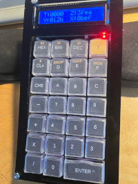
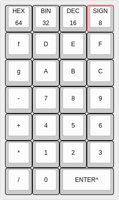

# hex-calc

Testing

Simple Hex/Binary/Decimal calculator inspired by HP-16C and TI Programmer.

[large image](pix/front.jpg)

Features:

* Hex / Decimal / Binary display in signed or unsigned mode
  * Entire stack for 8/16 bits, two levels for 32 bits
* four-function two-compliment or unsigned arithmetic
* 8 / 16 / 32 / 64 bit word size
* four-level RPN stack with roll / swap

Runs on ATMeg328 at 8MHz.  Power is 4xAA batteries regulated to 5V.
Industry-standard 16x2 backlit LCD.  Three LEDs:

* Power
* f key (function/shift) active
* signed display mode

Code in <tt>src/calc_hw</tt>.

KiCAD design in <tt>keyboard-pcb</tt>.
 Schematic:  [keyboard-pcb.pdf](keyboard-pcb/keyboard-pcb.pdf)

See https://github.com/eshazen/calc-demo-xwin for an X-windows
app written in C which illustrates the general idea.

## Enhancements

Thinking about some added features to support fractional arithmetic
for woodworking.  Display options to round to nearest fraction (1/4,
1/8, 1/16, 1/32, 1/64) and switch between decimal inch, fraction inch
and decimal mm.  Ft/inches another useful display option.

This would involve either floating point or scaled integer math.
For this application the range is pretty limited, maybe 8 ft (~100 in)
max.

Base units could be 2.54e-6 in (1um).  100 inches would require ~25
bits.  

